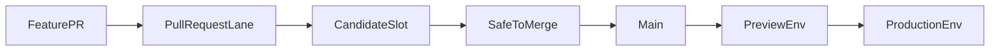

# CI/CD Pipeline Flow

## Overview

This spec defines the target CI/CD model for the repo:

- `main` is the only long-lived code branch
- pull requests prove safety before merge in fixed `candidate-*` slots
- accepted code promotes forward from `main` without rebuilds
- deploy branches hold environment state only and are reconciled by Argo CD

This document supersedes the old canary-first branch model. The branch model, deploy-state model, and axioms below are the live contract — workflows, scripts, and agent skills that diverge from it are bugs, not allowed drift.

## Core Axioms

1. **`main` is code truth**. It holds safe, accepted code.
2. **Code merges when safe, not merely when ready**. Incomplete work should be hidden behind flags or stay in PRs.
3. **Pre-merge safety happens in candidate or flight slots**. Do not call those lanes `canary`.
4. **Build once, promote by digest**. Downstream environments never rebuild artifacts.
5. **Deploy branches are environment state only**. `deploy/*` branches contain rendered deployment state, not product code.
6. **Argo owns reconciliation**. CI writes desired state to git; Argo syncs from git.
7. **Affected-only CI is the default**. Required checks should scope to the changed surface where practical.
8. **Release branches are exceptional only**. They are not the default path for accepted code.
9. **Direct edits to `deploy/*` are incident-only**. Repair the live environment first when necessary, then mirror the fix back into the normal source-of-truth path.
10. **Agent guidance is part of the control plane**. Prompts, skills, AGENTS files, and workflow docs must not tell agents to PR into or diff against legacy branches.
11. **Verification is a job-level gate, never a step-level skip** (bug.0321). GitHub treats a skipped step inside a running job as green. Every verification that is allowed to no-op (e.g. empty `promoted_apps`) must be gated at the _job_ level with `needs:` and `if:` so the job surfaces as **skipped (grey)** in the checks list, not as a silent-green success.
12. **Gate ordering is enforced structurally, not by convention** (bug.0321 Fix 4). When step A must precede step B in the same job, A writes a marker to `$GITHUB_ENV` (e.g. `ARGOCD_SYNC_VERIFIED=true`) and B refuses to run without it. Comments rot at the next refactor; runtime checks don't.
13. **Artifact provenance travels with the artifact** (bug.0321 Fix 4). `.promote-state/source-sha-by-app.json` on each deploy branch records per-app `source_sha` at promotion time. Production promotions copy it forward from preview; verifiers read it to assert per-app contract (`/version.buildSha == map[app]`), which is the only cross-PR-safe check when affected-only CI produces a mixed-SHA overlay. (task.0345 / PR #978 moved the probe from `/readyz.version` to the dedicated unauthenticated `/version` endpoint so that infra-degraded `/readyz` 503s cannot false-fail an artifact-identity check.)
14. **Skipped verification is not success** (bug.0328). When a downstream job (`release-slot`, `lock-preview-on-success`) consumes the result of a verification job that was gated `if: promoted_apps != ''` per Axiom 11, a `skipped` result is only a valid green signal when `promoted_apps == ''`. A skipped verification combined with a non-empty `promoted_apps` is a **contradiction** (the promote job pushed real digests but verification never ran, e.g. because `promote-build-payload.sh` aborted mid-run and left `$GITHUB_OUTPUT` empty), and must hard-fail the workflow. The job-level skip gate from Axiom 11 prevents _silent step-skip_ success; this axiom prevents _silent job-skip_ success at the consumer. Defense: emit `promoted_apps` incrementally + via `trap EXIT` so the signal survives abort, AND have consumers treat skip-with-promotions as failure.
15. **Argo "Healthy" is necessary but not sufficient** (bug.0326). `status.health.status == Healthy` fires as soon as enough pods are Ready — including pods from the **old** ReplicaSet during a rolling update. `wait-for-argocd.sh` therefore requires the promoted app's own `Deployment` resource inside the Argo `Application` to report `status=Synced`, then asserts the new ReplicaSet has reached desired count (`status.updatedReplicas >= spec.replicas` AND `status.availableReplicas >= spec.replicas`). It does **not** wait for the old ReplicaSet to fully drain — that condition is not part of the contract and routinely false-fails when an old pod terminates slowly while the new RS is already serving traffic. `verify-buildsha.sh` (run after) is the canonical "/version.buildSha == expected" proof per Axiom 19.
16. **`CATALOG_IS_SSOT`** (task.0374; supersedes the bug.0328 image-tags.sh-as-registry framing). `infra/catalog/*.yaml` is the single declaration site for nodes and node-shaped services for **CI fan-out and digest promotion**. Every consumer that needs a per-node enumeration reads catalog: `scripts/ci/lib/image-tags.sh` is a thin shim that populates `ALL_TARGETS` / `NODE_TARGETS` and resolves tag suffixes, node ports, DB names, and endpoint CSVs from catalog at source time, and node IDs from each node's `.cogni/repo-spec.yaml` (`REPO_SPEC_IS_IDENTITY_SSOT`, below); `scripts/ci/detect-affected.sh` maps changed paths to targets via catalog `path_prefix:`; ApplicationSet `files:` generators already enumerate catalog directly; per-workflow `decide` jobs read catalog via the `yq` pre-installed on `ubuntu-24.04` and emit `targets_json` + `apps_csv` outputs that downstream matrix cells consume; the **edge reverse-proxy roster** is catalog-driven too — `scripts/ci/render-caddyfile.sh` generates the Caddyfile by looping `NODE_TARGETS` (one site block per node, upstream port baked from catalog `node_port`), and `deploy-infra.sh` / `provision-env-vm.sh` write each node's per-env host (`host_for_node`) from one loop, so a new `type: node` auto-routes with no Caddyfile or deploy-script edit (task.5078). The scheduler-worker routing map is catalog-rendered as slug + `node_id` aliases by `scripts/ci/render-scheduler-worker-endpoints.sh`, and LiteLLM node-local metering callbacks are derived by `deploy-infra.sh` from the same catalog data. Catalog conformance is enforced on every PR by `check-jsonschema --schemafile infra/catalog/_schema.json infra/catalog/*.yaml` (pip-distributed CLI; no first-party GHA action), `scripts/ci/tests/render-caddyfile.test.sh` asserts the committed Caddyfile stays in sync with the catalog and `node_port` matches each per-env overlay Service nodePort (no split-brain), and `scripts/ci/render-scheduler-worker-endpoints.sh --check` asserts the committed scheduler-worker ConfigMap stays in sync with the catalog. Adding a node = drop a catalog yaml (incl. `node_port`; `node_id` lives in the node's `.cogni/repo-spec.yaml`, not the catalog) + Dockerfile + overlay; no hand-maintained route string should need editing. **Out of scope of this axiom (separate follow-ups):** `infra/compose/runtime/docker-compose.yml` per-service blocks and `infra/k8s/overlays/<env>/<node>/kustomization.yaml` generation. Both remain hand-maintained until a Kustomize-replacements / catalog-render pass lands.

    **`REPO_SPEC_IS_IDENTITY_SSOT`** (corollary). The catalog is the SSOT for _deploy-shape_ (ports, tag suffixes, branches, `path_prefix`) — never for _identity_. A node's `node_id` is the in-repo projection of its on-chain DAO and is declared exactly once, in `nodes/<name>/.cogni/repo-spec.yaml` (ROADMAP "Repo-Spec Authority"). `image-tags.sh` resolves `node_id` from repo-spec (locating the tree via the catalog root, so the pre-merge birth flow's `COGNI_CATALOG_ROOT=app-src/infra/catalog` reads the PR's specs); the scheduler-worker map, LiteLLM metering callbacks, and `COGNI_DEFAULT_NODE_ID` (the primary-host `node_id`, replacing the formerly-hardcoded operator UUID in `cogni_callbacks.py`) all derive from it. `infra/catalog/_schema.json` _forbids_ a `node_id` key (`not: { required: [node_id] }`) and `tests/ci-invariants/catalog-identity-ssot.spec.ts` asserts every `type: node` has a repo-spec `node_id` — so the duplicate cannot return.

    **Build classes (corollary).** `image-tags.sh` also exposes an `is_infra_target` predicate. **`type: infra`** (shared VM-infra images like `litellm`) builds in CI like everything else but **deploys via Compose-on-VM, not k8s/Argo** — so it is in `ALL_TARGETS` only (never `NODE_TARGETS`), the k8s plane (overlays/promotion/Argo/gitops-coverage) skips it via `is_infra_target`, and the schema makes deploy-branches/`node_*` conditional. `type:infra` images are **content-hash tagged** (`<name>-<hash>` via `infra_image_tag`, build dir = catalog `build_context`): the affected build rebuilds them only on change, and `deploy-infra.sh` resolves the identical tag — killing the former manual `docker build` + hand-pin toil. Adding one is a one-file catalog drop (`type: infra` + `build_context`); see [create-service.md](../guides/create-service.md) §9b-infra.

17. **`INFRA_K8S_MAIN_DERIVED`** (bug.0334). Every file under `infra/k8s/` on a deploy branch is byte-identical to `main` at the promoted SHA, OR is the per-overlay `env-state.yaml` (the VM-truth file written by provision). The promote workflow does a two-pass rsync: (1) `--ignore-existing` seed pass for `env-state.yaml` (bootstraps new overlays without clobbering VM-written IPs); (2) `--delete --exclude='env-state.yaml'` authoritative sync for everything else. Image digests are mutated by `promote-k8s-image.sh` after rsync — the only other deploy-branch-local write. Kustomize `replacements:` reads `env-state.yaml.data.VM_IP` and injects it into every EndpointSlice `/endpoints/0/addresses/0`, so VM IPs never live inline in `kustomization.yaml`. Violation: any non-digest, non-env-state diff between `main` and `deploy/<env>` after a promote.
18. **`LANE_ISOLATION` + `BRANCH_HEAD_IS_LEASE`** (task.0372 + task.0376). Each `(env, node)` pair has its own `deploy/<env>-<node>` branch and its own Argo Application; matrix-fanned per-node cells in `candidate-flight.yml` / `flight-preview.yml` / `promote-and-deploy.yml` write to the per-node branch only. Sibling-node failure cannot fail this cell — isolation is structural (separate GHA jobs with `fail-fast: false`), not a script-level filter. The branch ref is the lease: `concurrency: flight-${{ matrix.env }}-${{ matrix.node }}` (cancel-in-progress: false) serializes same-(env, node) writes across workflow types; cross-cell pushes go to different refs and never race. Pre-matrix `acquire-candidate-slot.sh` / `release-candidate-slot.sh` / `infra/control/candidate-lease.json` are retired. AppSets use `goTemplate: true` with `targetRevision: "deploy/<env>-{{.name}}"` (convention-over-config, not catalog-field indirection). Aggregator jobs (`aggregate-{preview,production}` in `promote-and-deploy.yml`) compute `current-sha = git merge-base $(deploy/<env>-<node> tips)` (`CURRENT_SHA_IS_MERGE_BASE`) and merge per-node `source-sha-by-app.json` entries into the rollup preserving unaffected entries (`ROLLUP_MAP_PRESERVES_UNAFFECTED`). `release.yml` reads the rollup `current-sha` byte-unchanged. Aggregators carry `concurrency: aggregate-${{ matrix.env }}` + rebase-retry on push (`AGGREGATOR_CONCURRENCY_GROUP`) and own preview lease state transitions (`AGGREGATOR_OWNS_LEASE`). Bootstrap: `scripts/ops/bootstrap-per-node-deploy-branches.sh` is idempotent + fast-forwarding; re-run as the last action immediately pre-merge of any AppSet / workflow flip (`BOOTSTRAP_FAST_FORWARDS_BEFORE_MERGE`). Catalog edits trigger full-matrix flights (`CATALOG_EDITS_ARE_GLOBAL_BUILD_INPUT`) so all per-node branches receive catalog changes in lockstep.
19. **`PER_NODE_DEPLOY_SELF_VALIDATES`** (task.0376; positive form of the anti-pattern shared by bug.0321 / bug.0326 / bug.0328 / bug.0336 / bug.0344 / bug.0379 and the 2026-04-26 preview+production Alchemy-cap outage). A per-node matrix cell exits `success` only when **its own** pods serve `/version.buildSha == build_sha` for that node, observed over HTTPS from outside the cluster, on the fresh ReplicaSet (per Axiom 15). No cell may exit 0 on absence: connection-refused, 502, 404, timeout, or an empty `/version` body is fail-closed with a distinct exit code, never green. A cell that promotes nothing for its node does not run verify; a cell that promotes anything MUST run verify (per Axiom 11) and MUST observe its own `/version` directly — no proxy, no upstream-signal substitution. Argo `health.status == Healthy` and `/readyz 200` are explicitly **insufficient** as success signals: the former is satisfied by old-ReplicaSet pods during a rolling update (Axiom 15), and the latter is necessarily fragile to transient external dependencies (RPC providers, billing-cap rejections, datastore blips) and must therefore degrade non-fatally rather than drain pods. Aggregator `success` is the AND of per-cell `success`; a single skipped-with-promotions cell hard-fails the aggregator (Axiom 14, applied per-node). `/version.buildSha` is the only signal that distinguishes "new code shipped" from "old code still running" from "no code running at all"; pipeline `exit 0` without that observation is the silent-success defect this axiom forbids. Enforced by `scripts/ci/resolve-cell-state.sh` (per-cell precondition gate), `scripts/ci/verify-buildsha.sh` (writes `verified-<node>.txt` only on contract-met success when `MARKER_DIR` is set), and `scripts/ci/aggregate-decide-outcome.sh` (asserts every promoted cell has a matching verified marker).
20. **`PRODUCTION_SCRIPTS_PINNED_TO_MAIN`** (task.0376). The `aggregate-production` job's `actions/checkout@v4` uses `ref: main` exclusively. A `workflow_dispatch` from any other ref runs the dispatched ref's workflow YAML, but the production-aggregator scripts on disk come from main — so a malicious or in-flight branch cannot inject `deploy/production` mutations by dispatching the workflow against itself. Branch protection on `main` is the actual gate; this axiom narrows the script-execution surface to that gate. Preview's aggregator deliberately uses `ref: ${{ github.sha }}` so the dispatched ref's scripts run end-to-end — pre-merge live testing on preview is intentional. The asymmetry is the contract: preview is testable from any ref, production is not.

## Branch And Deploy-State Model

```text
feature/* → PR → main                               (app code)
deploy/candidate-a, deploy/candidate-b, ...        (pre-merge env state)
deploy/preview, deploy/production                  (post-merge env state)
```

- **Feature branches** are short-lived and PR into `main`.
- **`main`** is the only long-lived shared code branch.
- **`deploy/candidate-*`** branches hold desired state for pre-merge safety lanes.
- **`deploy/preview`** and **`deploy/production`** hold desired state for post-merge promotion lanes.
- CI writes deployment state directly to deploy branches; Argo watches those branches and syncs the cluster.

**Key invariant**: CI never pushes application code to protected app branches.

**Key invariant**: Promotion means changing desired state in a deploy branch, not rebuilding an image.

## Delivery Lanes



### PR Lane

The PR lane is authoritative for merge safety in v0.

1. `pull_request` runs affected-only CI where available.
2. CI builds an immutable image for the exact PR head SHA.
3. The PR-head artifact is the authoritative v0 artifact.
4. Passing PRs become ready for manual candidate flight.
5. A human explicitly chooses which PR to flight next.
6. That chosen PR is deployed to `candidate-a` through `deploy/candidate-a`.
7. Candidate validation runs against the stable slot URL.
8. `candidate-flight` is authoritative for PRs explicitly sent to flight, but standard CI and build remain the universal merge gate in v0.

### Main Lane

The main lane is authoritative for promotion, not for pre-merge acceptance.

1. Merge to `main` records the accepted PR SHA.
2. The same proven digest promotes forward without rebuild.
3. `preview` is the first required post-merge promotion lane in v0.
4. Production promotion happens from the same digest by policy:
   - `release.yml` (manual dispatch) cuts a `release/*` PR from the preview
     current-sha into `main`; merging it is the code-truth gate.
   - A human directly dispatches `promote-and-deploy.yml` with
     `environment=production`, `source_sha=<preview current-sha>`, and
     `build_sha=<PR branch head SHA>`. `skip_infra=true` unless
     `infra/compose/**` changed. No intermediate PR: the dispatch IS the
     human gate, same entry point as preview uses. Same workflow, same
     verify-deploy contract, same e2e — just a different env input.
   - `promote-and-deploy.yml` promotes overlay digests on
     `deploy/production` and Argo CD reconciles production pods.

If a post-merge soak lane is retained later, it must be modeled as an explicitly named environment with a distinct purpose. The term `canary` must not be reused for pre-merge acceptance.

Merge queue is deferred in v0. If the repo later adopts merge queue, the workflow graph must add `merge_group` support and revisit artifact authority explicitly instead of assuming the PR-head artifact still maps cleanly to the accepted merge candidate.

## Minimum Authoritative Validation For V0

Do not block the rewrite on perfect black-box E2E maturity. For PRs explicitly sent to candidate flight in the current prototype, the required flight gate is:

- affected-only static checks plus unit tests
- successful image build for the exact PR SHA
- **Argo CD reconciled to the deploy-branch tip SHA, the promoted Deployment resource is `Synced`, and app health is acceptable** for every app in `PROMOTED_APPS` (`scripts/ci/wait-for-argocd.sh`)
- **new ReplicaSet available** for every promoted in-cluster Deployment (`scripts/ci/wait-for-in-cluster-services.sh`); routed node-apps also wait for Service endpoint cutover so public probes cannot hit an old pod
- a prototype smoke pack passes:
  - `/readyz` returns `200` on operator, poly, and resy
  - `/livez` returns structured JSON on operator, poly, and resy
- **contract probe passes**: `/version.buildSha` on each promoted node-app matches the SHA that built its overlay digest (`scripts/ci/verify-buildsha.sh` in `SOURCE_SHA_MAP` mode, reading `.promote-state/source-sha-by-app.json` from the deploy branch)
- any human or AI validation needed to call the change safe

These gates run inside a **`verify-candidate` job** (for pre-merge candidate flight) or **`verify-deploy` job** (for post-merge preview + production promotion), both gated `if: promoted_apps != ''` at the job level per Axiom 11.

Optional but non-authoritative in v0:

- auth or session sanity paths
- chat or completion probes
- scheduler or worker sanity probes
- one or two node-critical API probes
- richer black-box E2E suites
- AI probe jobs against the changed surface
- broader post-merge soak analysis

## Environment Model

### Candidate Environments

Candidate environments are fixed, pre-running slots reused across PRs. They exist to validate selected unknown code before merge without creating a new VM per PR.

| Environment | Deploy Branch        | Purpose                      |
| ----------- | -------------------- | ---------------------------- |
| candidate-a | `deploy/candidate-a` | manual pre-merge safety slot |

Start with `candidate-a` only. Add `candidate-b` later only after the one-slot prototype is proven stable.

### Promotion Environments

Promotion environments run accepted code only.

| Environment | Deploy Branch       | Purpose               |
| ----------- | ------------------- | --------------------- |
| preview     | `deploy/preview`    | post-merge validation |
| production  | `deploy/production` | production            |

This spec does not require a `canary` environment. If one is retained during migration, it must be described explicitly as a post-merge soak lane and not as a branch or as a pre-merge safety lane.

### Per-Node Deploy Branches (task.0320 + task.0372)

Per-node flighting lands in two parts to keep the rollout reversible and to preserve the promotion pipeline across the transition:

**task.0320 (substrate, this PR)**: each `infra/catalog/<node>.yaml` declares three per-env branch fields (`candidate_a_branch`, `preview_branch`, `production_branch`). These fields are **dormant** — no AppSet or workflow reads them yet. Post-merge, 12 deploy branches (`deploy/<env>-<node>` for each env × node) are pushed off each env's current HEAD, also dormant. The substrate introduces no behavior change; both the catalog fields and the new branches sit unused until task.0372.

**task.0372 (cutover)**: a single atomic PR refactors all three `infra/k8s/argocd/<env>-applicationset.yaml` files to 4 per-node git generators (each with `revision: deploy/<env>-<node>` and `files: [infra/catalog/<node>.yaml]`) AND cuts the flight workflows (`candidate-flight.yml`, `flight-preview.yml`, `promote-and-deploy.yml`) to `strategy.matrix` fan-out with `fail-fast: false`. Each matrix cell pushes only to its per-(env, node) branch and waits on only the matching Argo Application. AppSet-read and workflow-write flip to the per-node branches in the same merge — no window where the pipeline can get stuck writing to a ref that AppSets no longer watch.

Application names stay `<env>-<node>` across the transition — the AppSet template name is unchanged. Only each Application's `targetRevision` flips from the whole-slot `deploy/<env>` to the per-node `deploy/<env>-<node>`.

The branch-per-(env, node) primitive mirrors [Kargo](https://kargo.akuity.io) Stage semantics (`Stage = per-env-per-node Application` tracking its own immutable-per-promotion ref), implemented on existing ApplicationSet + deploy-branch infrastructure without introducing new CRDs, controllers, or long-running services.

### Preview Review Lock

`deploy/preview` holds a small state directory, `.promote-state/`, that drives merge-to-main flighting. Three files:

- **`candidate-sha`** — the most recent successfully built merge-to-main SHA. High-water mark. Written unconditionally on every flight attempt (`unlocked`, `dispatching`, or `reviewing`). Policy is **latest-wins, not FIFO**: if a hotfix is queued behind a later merge, only the latest is retained.
- **`current-sha`** — the SHA actually deployed to preview and under human review. Written only after a preview deploy reaches the E2E success step. `create-release.sh` reads this to cut release branches.
- **`review-state`** — `unlocked | dispatching | reviewing`. This is a pre-dispatch lease, not a boolean.

Transitions:

| From → To                 | Written by                                                  | Trigger                                                                                                                                                                                                                                                                                                                       |
| ------------------------- | ----------------------------------------------------------- | ----------------------------------------------------------------------------------------------------------------------------------------------------------------------------------------------------------------------------------------------------------------------------------------------------------------------------- |
| `unlocked → dispatching`  | `scripts/ci/flight-preview.sh`                              | merge to main (or manual flight dispatch); atomic with `candidate-sha` update                                                                                                                                                                                                                                                 |
| `dispatching → reviewing` | `lock-preview-on-success` job in `promote-and-deploy.yml`   | preview deploy reaches E2E success; writes `current-sha`                                                                                                                                                                                                                                                                      |
| `dispatching → unlocked`  | `unlock-preview-on-failure` job in `promote-and-deploy.yml` | any of `promote-k8s`, `deploy-infra`, `verify`, `verify-deploy`, `e2e` does not reach success (failure, cancelled, or skipped). Empty-promotion runs legitimately skip `verify-deploy` and therefore `e2e`, which fires unlock — preview stays unlocked instead of silently advancing its lease against an unchanged overlay. |
| `reviewing → unlocked`    | `auto-merge-release-prs.yml`                                | release PR merges                                                                                                                                                                                                                                                                                                             |

On release-merge unlock, if `candidate-sha != current-sha` the workflow dispatches a fresh flight with `sha=candidate-sha` to drain the queue. A flight concurrency group (`flight-preview`) serializes entry to the `unlocked → dispatching` transition; the three-value lease is the correctness guarantee even if concurrency is bypassed.

**Direct pushes to main are not a supported flight trigger.** The flight workflow re-tags `pr-{N}-{sha}` → `preview-{sha}` in GHCR and requires an associated PR number; direct pushes exit 0 with a message. Maintenance commits on `main` that carry no merged PR would trip the same PR-resolution guardrail, so `flight-preview.yml` skips its `flight` job when `github.event.head_commit.message` starts with either prefix: `chore(deps): argocd-image-updater` (bug.0344 Image Updater write-back) or `chore(preview):` (task.0349 digest-seed on `main`). Keying is **message-prefix**, not author identity (`github-actions[bot]` is shared).

## Workflow Design Targets

When implementation begins, workflow changes should follow these rules:

1. **Two lanes only**. One PR safety lane and one main promotion lane.
2. **No branch-name inference for environment routing**. Environment selection must be explicit input, artifact metadata, or deployment-state driven.
3. **No default `release/* -> main` conveyor**. If production still needs explicit approval, make it an environment or promotion control rather than a separate accepted-code branch.
4. **No duplicate orchestration**. E2E, promote, and deploy ownership should be clear rather than split across overlapping workflow graphs.
5. **No legacy branch guidance in prompts or docs**. Agents should not be told to diff against or PR into `staging` or a long-lived `canary` branch.

### App and infra levers are independent (task.0314)

Candidate-a deploy has two orthogonal levers; either can be dispatched independently:

| Workflow                     | Role        | Touches Argo (k8s pods) | Touches VM compose |
| ---------------------------- | ----------- | ----------------------- | ------------------ |
| `candidate-flight.yml`       | App lever   | Yes                     | No                 |
| `candidate-flight-infra.yml` | Infra lever | No                      | Yes                |

- **App lever** writes image digests to `deploy/candidate-a`; Argo CD reconciles pods. No VM SSH for compose. This upholds the `Argo owns reconciliation` axiom.
- **Infra lever** rsyncs `infra/compose/**` from a named git ref (default `main`) to the candidate-a VM and runs `compose up`. It never writes to a `deploy/*` branch.
- `scripts/ci/deploy-infra.sh` accepts `--ref <git-ref>` (default `main`) and `--dry-run`. The rsync source is a detached `git worktree add` of the ref, NOT the caller workflow's checkout — app PRs branched before an infra change can be flown without rebasing.

For `promote-and-deploy.yml` (preview/prod merge path), the job graph is:

```text
promote-k8s ─► deploy-infra ─┬─► verify-deploy ─┐
                             └─► verify         ┴─► e2e ─┬─► lock-preview-on-success
                                                         └─► unlock-preview-on-failure
```

- `verify-deploy` is job-level gated `if: promote-k8s.outputs.promoted_apps != ''` (Axiom 11). Runs `wait-for-argocd` → `wait-for-in-cluster-services` → `verify-buildsha` (`SOURCE_SHA_MAP` mode). Depends on `deploy-infra` so secrets-restart completes before the contract probes run.
- `verify` and `verify-deploy` run in parallel from the `deploy-infra` fan-out; `verify` is the always-on DOMAIN probe, `verify-deploy` is the gated contract probe.
- Empty-promotion runs (infra-only, docs-only, queue-only) → `verify-deploy` skipped → `e2e` skipped → `lock-preview-on-success` skipped → `unlock-preview-on-failure` fires (Axiom 11 + Axiom 12).
- The `candidate-flight.yml` workflow mirrors this with a `flight → verify-candidate → release-slot` graph (plus `report-no-acquire-failure` for pre-acquire failures). `verify-candidate` uses the same `wait-for-argocd → readiness → verify-buildsha` chain and the same `if: promoted_apps != ''` job-level gate. `release-slot.Decide lease state` enforces Axiom 14 — `verify-candidate.result == skipped` is only accepted as success when `flight.outputs.promoted_apps == ''`; a skip against a non-empty promoted_apps fails the job with an explicit `::error::`. `wait-for-argocd.sh` enforces Axiom 15 — once Argo reports the deploy-branch revision, acceptable app health, and a `Synced` Deployment resource for each promoted app, it asserts `status.updatedReplicas >= spec.replicas` AND `status.availableReplicas >= spec.replicas` on the Deployment (new RS has reached desired count) before `verify-buildsha` curls **`/version`** and asserts **`.buildSha`** (task.0345 / #978; not `/readyz`). It does not wait for the old ReplicaSet to drain — that is `kubectl rollout status` behavior we deliberately avoid because slow terminations false-fail healthy deploys.

### Source-SHA Map Provenance

Every deploy branch carries `.promote-state/source-sha-by-app.json` — a merge-semantics JSON map from app name to the PR head SHA that built that app's current overlay digest.

```json
{
  "operator": "abc123...",
  "poly": "def456...",
  "resy": "abc123...",
  "scheduler-worker": "abc123..."
}
```

**Writers** (bug.0321 Fix 4):

- `scripts/ci/update-source-sha-map.sh` — shared primitive that merges a single `app → sha` entry into the file. Untouched apps retain their prior entry (merge, not overwrite).
- `scripts/ci/promote-build-payload.sh` — calls the primitive after each promoted app (candidate-flight path).
- `.github/workflows/promote-and-deploy.yml` promote-k8s loop — calls the primitive after each promoted app (preview + production path).
- Production promotion: a human dispatches `promote-and-deploy.yml` with `environment=production`, `source_sha=<preview current-sha>`, `build_sha=<PR branch head SHA>`. The `promote-k8s` job reads preview's overlay digests through the shared `preview-{sha}` tag convention, copies them onto `deploy/production`, and carries `.promote-state/source-sha-by-app.json` forward so `verify-buildsha.sh` can assert cross-PR mixed-SHA contract.

**Reader**: `scripts/ci/verify-buildsha.sh` in `SOURCE_SHA_MAP` mode. When `NODES` is set (candidate-flight / promote-and-deploy pass `promoted_apps`), verifies only those apps' map entries — not every key in the file — so affected-only runs do not false-fail untouched apps (task.0349). When `NODES` is unset, every Ingress-probeable key in the map is checked. Each probe curls `/version` and asserts `.buildSha == map[app]`. (The probe is the dedicated `/version` endpoint, not `/readyz` — task.0345 / PR #978.)

**Why the map instead of a single `EXPECTED_BUILDSHA`**: production promotions copy preview's overlays, which can mix digests from different PR head SHAs (affected-only CI rebuilds a subset). A single SHA check is only valid when every promoted app comes from the same build; the map is the only cross-PR-safe contract.

## Deploy Branch Rules

- Deploy branches are long-lived, machine-written environment-state refs.
- `infra/k8s/` tracks `main` under invariant `INFRA_K8S_MAIN_DERIVED` (Axiom 17). Only image digests (mutated by `promote-k8s-image.sh`) and `env-state.yaml` files (written by provision) are allowed to differ from main. All other overlay content — ConfigMap patches, Service patches, resource lists, `replacements:` blocks — is rsynced from main every promote.
- **Preview digest seed on `main` (INFRA_K8S_MAIN_DERIVED)** — `promote-and-deploy.yml` rsyncs `infra/k8s/` from **main** at the promoted SHA into `deploy/preview` before mutating digest lines. Therefore `main:infra/k8s/overlays/preview/<app>/kustomization.yaml` digest pins are the **rsync seed** for every later preview promote; they must stay pullable and aligned with GHCR.
- **task.0349 — CI-owned seed (preferred path)** — Only when Flight Preview **dispatched** `promote-and-deploy` (preview lease was `unlocked`, not queue-only), [`promote-preview-digest-seed.yml`](../../.github/workflows/promote-preview-digest-seed.yml) runs [`scripts/ci/promote-preview-seed-main.sh`](../../scripts/ci/promote-preview-seed-main.sh) (**Option B**: direct `promote-k8s-image.sh --no-commit` calls; does **not** reuse `promote-build-payload.sh`, which is coupled to deploy-branch `.promote-state/` provenance). **Tri-state per image:** resolve `preview-{mergeSha}{suffix}` when the merge produced/retagged that image; else **retain** the existing pin from the overlay if it still resolves in GHCR; else **fail**. Emits at most **one** `chore(preview): …` commit to `main` per such merge when overlay lines change. **Queue-only** Flight Preview runs (lease `reviewing` / `dispatching`) upload outcome `queued` and **do not** trigger digest seed — no bot commits for those merges. The workflow uses a read-only job plus verified checkout (`head_sha` must be an ancestor of `origin/main`) before `contents:write` push. **`preview-dispatched-marker`** in `flight-preview.yml` is skipped (grey) when the flight was queue-only, so branch protection can require it as the "preview actually dispatched" signal.
- **bug.0344 / task.0349 — Image Updater vs preview seed** — `preview-applicationset.yaml` carries **no** `argocd-image-updater.argoproj.io/*` annotations (task.0349): preview digest pins on `main` are CI-owned (`flight-preview` / `promote-and-deploy` / [`promote-preview-digest-seed.yml`](../../.github/workflows/promote-preview-digest-seed.yml)). The Image Updater controller may still be installed in-cluster from earlier bootstrap; it is no longer wired via this AppSet. **Scope guard:** [`scripts/ci/check-image-updater-scope.sh`](../../scripts/ci/check-image-updater-scope.sh) requires **zero** annotations on every `*-applicationset.yaml` (empty allowlist until a future work item re-introduces updater-backed envs). Bootstrap history: [docs/runbooks/image-updater-bootstrap.md](../runbooks/image-updater-bootstrap.md).
- **task.0373 — candidate-a self-heal (no main-seed)** — `candidate-flight.yml`'s `Sync base and catalog to deploy branch` step rsyncs `infra/k8s/overlays/candidate-a/` from the **PR branch** (not from `main`). Stale PR-branch overlay digests would therefore clobber known-good `deploy/candidate-a` digests for non-promoted apps and roll Argo to a regressing image. Fix: snapshot `deploy/candidate-a` overlay digests pre-rsync ([`scripts/ci/snapshot-overlay-digests.sh`](../../scripts/ci/snapshot-overlay-digests.sh)); after `promote-build-payload.sh` writes promoted apps' fresh digests, restore each non-promoted target's pre-rsync digest via `promote-k8s-image.sh --no-commit`. **Authority consequence:** because candidate-flight does not rsync from `main`, `main:infra/k8s/overlays/candidate-a/<app>/kustomization.yaml` digest pins have **no consumer** and are therefore **advisory and may lag** GHCR — explicitly the opposite of preview's `INFRA_K8S_MAIN_DERIVED` constraint. Cold-start (first flight against a freshly-created `deploy/candidate-a`) reads the PR-branch state into the snapshot; restore is a no-op, which is acceptable because there is no prior good state to preserve. **No new workflow, no new privileged push to main, no new maintenance message-prefix.**
- **Prettier + machine YAML** — `infra/k8s/overlays/**/kustomization.yaml` stays prettier-ignored because `promote-k8s-image.sh` and related CI writers emit YAML that does not match Prettier's style.
- They are never merged back into app branches.
- PRs are not required for routine automated deploy-state updates; git history is the audit trail.
- Push access on `deploy/*` should be restricted to the CI app or bot, with incident-only human bypass if needed.
- Rollback is by reverting deployment-state commits.

## Known Unknowns

Track these explicitly during the spec rewrite, following the CI/CD scorecard style of keeping unresolved questions visible:

- [ ] **Candidate selection and slot control**
      Define the manual flight trigger, lease, timeout, cleanup, and status ownership without building a queueing system into v0.
- [ ] **E2E validation workflows**
      Decide what stays in the authoritative v0 gate versus what remains advisory, and define how smoke tests, richer black-box E2E, and post-merge validation divide across the PR lane and main lane.
- [ ] **Git-manager agent as a first-class control-plane actor**
      Define whether a git-manager style agent owns PR build tracking, candidate slot coordination, deploy-branch promotion, and status reporting, or whether those responsibilities stay in plain workflows with agent assistance around them.
- [ ] **Production seed freshness**
      Preview overlay seeds on `main` are CI-owned (task.0349); candidate-flight self-heals `deploy/candidate-a` around the PR-branch rsync (task.0373) so `main:infra/k8s/overlays/candidate-a/**` digests are advisory only — no main-seed needed for candidate-a; production overlays on `main` stay human-gated via direct `promote-and-deploy.yml` dispatch (env=production). Still open: a detection signal for production seed staleness (Loki/Grafana query on overlay-digest age), and whether production should follow the candidate-a self-heal pattern or the preview main-seed pattern when its rsync source is decided.
- [ ] **Rollout-status health check to replace task.0341 polling (bug.0345)**
      Argo reporting Healthy before the old ReplicaSet drains is a health-check-semantics bug, not a polling-interval bug. Bumping the poll window doesn't fix it. Fix: `kubectl rollout status deployment/X --timeout=5m` (observes `observedGeneration`, `updatedReplicas == replicas`, `Progressing=NewReplicaSetAvailable`) OR a proper Argo Deployment health check with correctly-wired probes. task.0341 solved at the wrong layer; replacement is bug.0345.
- [ ] **OpenFeature flags**
      Decide how feature flags reduce PR scope, shrink risky surface area, and let code merge when safe without requiring every incomplete capability to be fully user-exposed.
- [ ] **Merge queue integration later**
      If concurrency pressure eventually justifies merge queue, add `merge_group` workflows and revisit authoritative artifact selection at that time rather than mixing both models in v0.

## Legacy Surfaces To Retire

The following patterns are now legacy and should be removed during implementation:

- long-lived `staging` or `canary` code-branch semantics
- branch-based environment inference in workflow logic
- prompts, skills, AGENTS files, or workflow docs that steer agents toward `origin/staging` or PRs into non-`main` branches
- release branch enforcement as the normal path for accepted code
- namespace, overlay, or deploy-state naming that still encodes `staging` for the preview lane

## Non-Goals For V0

This spec does not require:

- fully dynamic per-PR ephemeral environments
- perfect end-to-end coverage before adopting the model
- a production release branch for every accepted change
- a decision today on every future soak, canary, or experimentation lane

## Related Documentation

- [CD Pipeline E2E](cd-pipeline-e2e.md) — trunk-alignment guide mapping legacy multi-node GitOps design to the target workflow and code-task changes
- [Candidate Slot Controller](candidate-slot-controller.md) — v0 design for lease, TTL, superseding-push handling, and aggregate candidate-flight status
- [CD Pipeline E2E Legacy Canary](cd-pipeline-e2e-legacy-canary.md) — historical canary/staging-era multi-node GitOps detail retained for reference during migration
- [Node CI/CD Contract](node-ci-cd-contract.md) — CI/CD sovereignty invariants, file ownership
- [Application Architecture](architecture.md) — Hexagonal design and code organization
- [Deployment Architecture](../runbooks/DEPLOYMENT_ARCHITECTURE.md) — Infrastructure details
- [CI/CD Conflict Recovery](../runbooks/CICD_CONFLICT_RECOVERY.md) — historical release conflict recovery guidance
