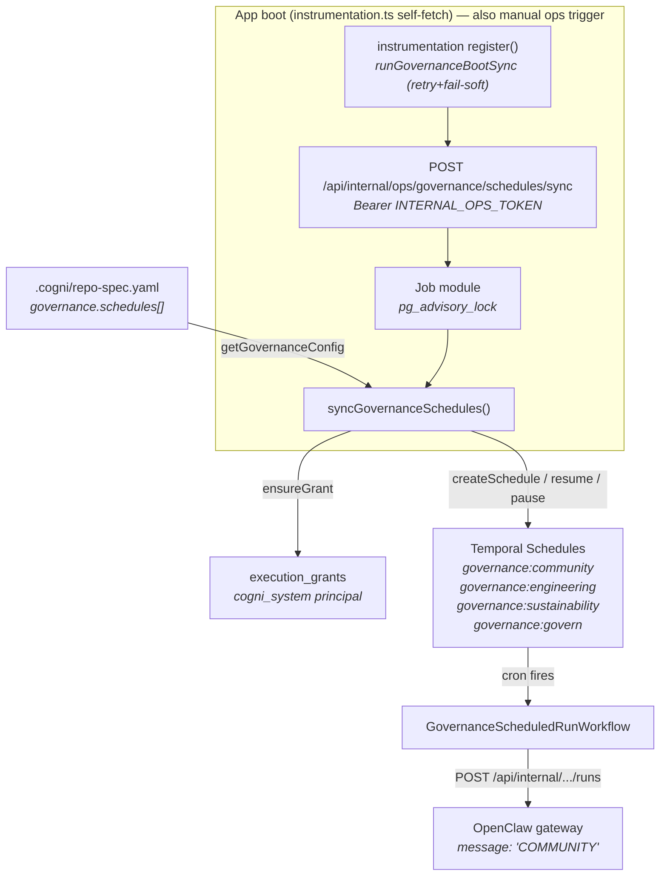
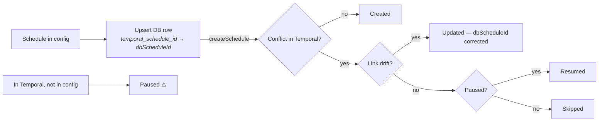

# Governance Schedule Sync

> Repo-spec declares charter + ledger schedules. Each node self-syncs them to Temporal at boot. Temporal fires cron. Worker executes governance run via OpenClaw.

### Key References

|             |                                                                                       |                         |
| ----------- | ------------------------------------------------------------------------------------- | ----------------------- |
| **Project** | [proj.system-tenant-governance](../../work/projects/proj.system-tenant-governance.md) | Roadmap and planning    |
| **Spec**    | [Scheduler](scheduler.md)                                                             | Grants, workflows, runs |

## Design



> **💡 Preview Environments**
>
> Set `GOVERNANCE_SCHEDULES_ENABLED=false` to skip schedule sync in preview deployments (prevents duplicate governance operations). Defaults to `true`. The boot-sync helper honors this flag (skips before calling the endpoint); the endpoint also returns 204 when disabled.

### Runtime Identity Model

- Governance schedules are first-class DB rows in the `schedules` table, owned by `COGNI_SYSTEM_PRINCIPAL_USER_ID`.
- Temporal schedule IDs (`governance:community` etc.) stored in the `temporal_schedule_id` column (partial unique index).
- Workflow payload includes `temporalScheduleId` and `dbScheduleId` (UUID from the DB row).
- Idempotency key uses `temporalScheduleId:scheduledFor`.
- `next_run_at` in DB is a cron-derived cache computed at upsert time. Temporal is authoritative.

### Sync Logic (per schedule)



### Config Schema

```yaml
# .cogni/repo-spec.yaml
governance:
  schedules:
    - charter: COMMUNITY # unique key → schedule ID governance:community
      cron: "0 */6 * * *" # 5-field cron
      timezone: UTC # IANA (default: UTC)
      entrypoint: COMMUNITY # 1-word trigger → OpenClaw gateway
```

`governance` is optional — defaults to `{ schedules: [] }`. Validated by `governanceScheduleSchema` (Zod).

### Execution Layers

| Layer     | File                                                              | Responsibility                                    |
| --------- | ----------------------------------------------------------------- | ------------------------------------------------- |
| Boot      | `src/lib/governance-boot-sync.ts`                                 | Self-fetch trigger at startup (retry + fail-soft) |
| Endpoint  | `src/app/api/internal/ops/governance/schedules/sync/route.ts`     | Internal auth + trigger                           |
| Job       | `src/bootstrap/jobs/syncGovernanceSchedules.job.ts`               | Advisory lock + container wiring                  |
| Service   | `packages/scheduler-core/src/services/syncGovernanceSchedules.ts` | Pure orchestration via ports                      |
| Re-export | `src/features/governance/services/syncGovernanceSchedules.ts`     | Feature-layer convenience                         |

## Goal

Repo-spec is source of truth for governance schedules. Temporal is derived state, synced idempotently at every node boot (and on-demand via the ops endpoint).

## Non-Goals

- **No cron update detection** — changed cron requires manual delete+recreate
- **No heartbeat/monitoring** — schedule creation only
- **No tenant API** — system-ops only, never exposed as endpoint

## Invariants

| Rule                         | Constraint                                                                                                                            |
| ---------------------------- | ------------------------------------------------------------------------------------------------------------------------------------- |
| REPO_SPEC_IS_SOURCE_OF_TRUTH | `.cogni/repo-spec.yaml` declares schedules; Temporal is derived                                                                       |
| PRUNE_IS_PAUSE               | Removed schedules are paused, never deleted (reversible)                                                                              |
| SYSTEM_TENANT_IS_TENANT      | Governance schedules are first-class DB rows owned by system principal; Temporal schedule IDs stored in `temporal_schedule_id` column |
| SYSTEM_OPS_ONLY              | Sync runs at node boot (self-fetch) or via the internal ops endpoint; never callable by tenants                                       |
| GRANT_ON_DEMAND              | Governance grant created idempotently by sync, not by migration                                                                       |
| OVERLAP_SKIP_ALWAYS          | All governance schedules use `overlap=SKIP` (one run at a time)                                                                       |
| SINGLE_WRITER                | `pg_advisory_lock(hashtext('governance_sync'))` prevents concurrent sync                                                              |
| PURE_ORCHESTRATION           | Sync function depends only on ports/types/callbacks — no adapters                                                                     |
| LINK_DRIFT_SELF_HEAL         | If Temporal schedule has wrong/missing `dbScheduleId`, sync detects drift and updates                                                 |

### File Pointers

| File                                                              | Purpose                          |
| ----------------------------------------------------------------- | -------------------------------- |
| `.cogni/repo-spec.yaml`                                           | Schedule declarations            |
| `src/shared/config/repoSpec.schema.ts`                            | `governanceScheduleSchema`       |
| `src/shared/config/repoSpec.server.ts`                            | `getGovernanceConfig()` accessor |
| `packages/scheduler-core/src/services/syncGovernanceSchedules.ts` | Canonical sync logic             |
| `src/app/api/internal/ops/governance/schedules/sync/route.ts`     | Internal trigger endpoint        |
| `src/bootstrap/jobs/syncGovernanceSchedules.job.ts`               | Job module (lock + wiring)       |
| `src/lib/governance-boot-sync.ts`                                 | Boot-time self-sync trigger      |
| `src/instrumentation.ts`                                          | Calls boot-sync in `register()`  |
| `src/app/api/internal/graphs/[graphId]/runs/route.ts`             | Input normalization + state key  |
| `packages/scheduler-core/src/ports/schedule-control.port.ts`      | `listScheduleIds`                |
| `packages/scheduler-core/src/ports/execution-grant.port.ts`       | `ensureGrant`                    |

## Open Questions

_(none)_

## Related

- [Scheduler Spec](scheduler.md) — Execution infrastructure, grants, workflows
- [Governance Council](governance-council.md) — Distributed GOVERN architecture
- [OpenClaw Sandbox](openclaw-sandbox-spec.md) — Gateway execution
